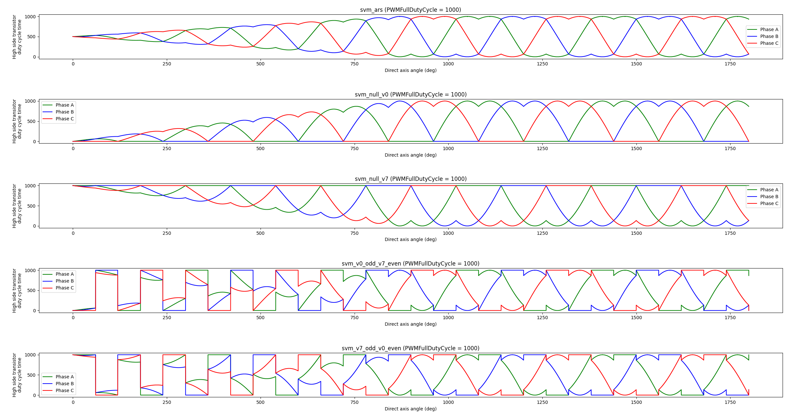

# VESC Firmware

VESC firmware for https://github.com/Rampagy/bldc-hardware

## Control

There are two control schemes that are supported: sinusoidal pulse width modulation (spwm), and space vector pulse width modulation (svpwm).

## Tools

* [gcc](https://sourceforge.net/projects/mingw/files/latest/download) (for unit testing)
* python (for autogenerating lookup tables)

## Tests

To test do the following:

1. Navigate to tests folder via console `cd tests`
1. Run `build_and_run_tests.bat`

## Commutation Techniques

Over all there can be up to a 5.5% efficiency improvement by choosing the appropriate commutation technique.

